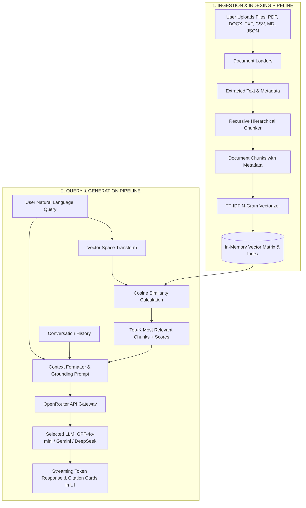
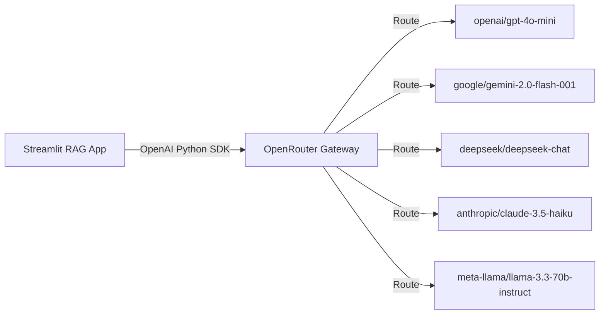

# 🧠 Comprehensive Technical Architecture & Engineering Documentation

This document explains in detail how the **AI Document RAG Assistant** works under the hood — covering document parsing, chunking algorithms, vectorization and embeddings, query understanding, context synthesis, OpenRouter LLM orchestration, and response streaming with source citations.

---

## 📑 Table of Contents

1. [High-Level System Architecture](#1-high-level-system-architecture)
2. [Document Ingestion & Multi-Format Parsing](#2-document-ingestion--multi-format-parsing)
3. [Chunking Strategy & Mechanics](#3-chunking-strategy--mechanics)
4. [Vectorization, Embeddings & Similarity Search](#4-vectorization-embeddings--similarity-search)
5. [Query Understanding & Context Assembly](#5-query-understanding--context-assembly)
6. [OpenRouter LLM Integration & Models](#6-openrouter-llm-integration--models)
7. [Response Generation & Citation Flow](#7-response-generation--citation-flow)
8. [Component Reference Map](#8-component-reference-map)

---

## 1. High-Level System Architecture

The application follows the classic **Retrieval-Augmented Generation (RAG)** design pattern, composed of two parallel pipelines:
* **Ingestion & Indexing Pipeline** (Offline / On File Upload)
* **Query & Generation Pipeline** (Online / When User Asks a Question)



---

## 2. Document Ingestion & Multi-Format Parsing

Located in: [`core/document_loader.py`](file:///c:/Users/abhin/OneDrive/Documents/RAG/core/document_loader.py)

When a user attaches files via the UI, the byte stream is received and routed to dedicated format parsers:

| File Type | Extractor Engine | Extraction Mechanism & Preserved Metadata |
|---|---|---|
| **`.pdf`** | `pypdf.PdfReader` | Extracts text page-by-page. Records `page_number`, `total_pages`, and file source. |
| **`.docx`** | `python-docx` | Traverses paragraphs and converts document tables into formatted text blocks. |
| **`.csv`** | `pandas` | If $\le 100$ rows, converts to Markdown table format; if larger, computes column summaries + statistical distributions (`describe()`) + sample preview. |
| **`.json`** | `json` | Parses and formats into pretty-printed structured key-value text. |
| **`.txt`, `.md`, `.log`** | UTF-8 / Latin-1 Stream Reader | Multi-encoding safe reader with null-byte removal and empty line normalization. |

### Document Object Schema
```python
@dataclass
class Document:
    content: str                 # Cleaned text
    metadata: Dict[str, Any]     # {"source": "report.pdf", "page": 2, "type": "pdf"}
```

---

## 3. Chunking Strategy & Mechanics

Located in: [`core/chunking.py`](file:///c:/Users/abhin/OneDrive/Documents/RAG/core/chunking.py)

Raw document text is often too large to fit in an LLM context window efficiently and dilutes retrieval relevance. The chunker splits documents into semantically coherent segments.

### A. Hierarchical Recursive Separator Splitting
Instead of naive character splitting (which cuts words and sentences in half), the algorithm evaluates separators in decreasing order of semantic importance:
1. `\n\n` (Paragraph boundaries)
2. `\n` (Line breaks)
3. `. `, `! `, `? ` (Sentence terminations)
4. `; `, `, ` (Clause breaks)
5. `" "` (Word boundaries)

### B. Sliding Window & Chunk Overlap
* **Chunk Size** (Default: `600` characters): Controls the maximum segment size.
* **Chunk Overlap** (Default: `100` characters): Appends the trailing $N$ characters from the previous chunk to the beginning of the next chunk. This guarantees that sentences crossing chunk boundaries are not lost during vector matching.

```text
Document: [--- Sentence 1 ---][--- Sentence 2 ---][--- Sentence 3 ---][--- Sentence 4 ---]
Chunk 1:  [=================== Chunk Size ===================]
Chunk 2:                [== Overlap ==][=================== Chunk Size ===================]
```

### C. Chunk Metadata & Citation Generation
Each chunk receives a unique identifier and metadata:
```python
chunk.citation -> "annual_report.pdf (Page 4, Chunk #12)"
```

---

## 4. Vectorization, Embeddings & Similarity Search

Located in: [`core/vector_store.py`](file:///c:/Users/abhin/OneDrive/Documents/RAG/core/vector_store.py)

To find the most relevant parts of the documents for any given question, the system converts text chunks into **vector embeddings** in a high-dimensional vector space.

### A. Mathematical Vector Model (TF-IDF with Sublinear N-Grams)
The vectorizer builds a sparse vector representation for each chunk using **Term Frequency - Inverse Document Frequency (TF-IDF)** with character and word n-grams:

$$\text{TF-IDF}(t, d, D) = \text{TF}_{\text{sublinear}}(t, d) \times \text{IDF}(t, D)$$

1. **Sublinear Term Frequency Scaling**:
   $$\text{TF}_{\text{sublinear}}(t, d) = 1 + \log(\text{TF}(t, d)) \quad \text{for } \text{TF}(t, d) > 0$$
   *Prevents documents with repetitive words from unfairly dominating scores.*

2. **Inverse Document Frequency**:
   $$\text{IDF}(t, D) = \log\left(\frac{1 + |D|}{1 + |\{d \in D : t \in d\}|}\right) + 1$$
   *Penalizes common words and boosts discriminative technical terms.*

3. **N-Gram Range $(1, 2)$**:
   Captures both individual keywords (e.g. `"revenue"`) and composite phrases (e.g. `"net revenue"`, `"machine learning"`).

### B. Cosine Similarity Calculation
When a query $Q$ arrives, it is transformed into the same vector space. The similarity score between query vector $\vec{Q}$ and chunk vector $\vec{D}$ is calculated via the normalized dot product:

$$\text{Cosine Similarity}(\vec{Q}, \vec{D}) = \frac{\vec{Q} \cdot \vec{D}}{\|\vec{Q}\|_2 \|\vec{D}\|_2} = \frac{\sum_{i=1}^{n} Q_i D_i}{\sqrt{\sum_{i=1}^{n} Q_i^2} \sqrt{\sum_{i=1}^{n} D_i^2}}$$

* Output range: $[0.0, 1.0]$.
* The vector store sorts all chunks in descending order and returns the **Top-K** highest scoring chunks.

### C. Lexical Fallback Engine
If a user query consists of out-of-vocabulary terms or rare identifiers where vector dot product is 0, the system automatically falls back to an exact token-overlap scoring mechanism so queries never return empty when text matches exist.

---

## 5. Query Understanding & Context Assembly

Located in: [`core/llm.py`](file:///c:/Users/abhin/OneDrive/Documents/RAG/core/llm.py)

Once the Top-K chunks are retrieved, the RAG engine transforms the user question into an **Augmented Prompt**.

### Context Injection Template
The retrieved chunks are formatted with clear document demarcation headers:

```text
--- [Doc 1: contract.pdf, Page 3 | Similarity Score: 0.82] ---
Section 4.1: The delivery timeline is scheduled for 30 business days after receipt...

--- [Doc 2: project_plan.docx | Similarity Score: 0.65] ---
Phase 2 milestones include backend integration and QA verification...
```

### System Instruction & Grounding
The LLM is given strict system rules:
1. **Truthfulness**: Answer ONLY based on the provided document context.
2. **Citations**: Explicitly cite statements with `[Doc 1]`, `[Doc 2]`, or `[Filename (Page X)]`.
3. **No Hallucination**: If the answer is not present in the files, state what is missing rather than inventing facts.
4. **Chat Memory**: Retains the last 6 conversational turns to support follow-up questions (e.g., *"Can you elaborate on that?"*).

---

## 6. OpenRouter LLM Integration & Models

Located in: [`core/llm.py`](file:///c:/Users/abhin/OneDrive/Documents/RAG/core/llm.py)

### OpenRouter Architecture
[OpenRouter](https://openrouter.ai) serves as an unified API gateway compatible with the OpenAI API specification (`https://openrouter.ai/api/v1`).



### Supported Models Available in the UI

| Model Identifier | Provider | Characteristics & Use Cases |
|---|---|---|
| `openai/gpt-4o-mini` | OpenAI | Extremely fast, cost-effective, high reasoning accuracy. |
| `google/gemini-2.0-flash-001` | Google | Sub-second latency, excellent long context comprehension. |
| `deepseek/deepseek-chat` | DeepSeek | Highly capable V3 model, affordable pricing. |
| `anthropic/claude-3.5-haiku` | Anthropic | Crisp formatting, concise responses, strong instruction following. |
| `meta-llama/llama-3.3-70b-instruct` | Meta | State-of-the-art open-weights model. |
| `custom` | Any | Allows entering any model ID supported on OpenRouter (e.g. `anthropic/claude-3.5-sonnet`, `mistralai/mistral-large`). |

---

## 7. Response Generation & Citation Flow

Located in: [`app.py`](file:///c:/Users/abhin/OneDrive/Documents/RAG/app.py)

### A. Real-Time Token Streaming
When the user submits a query:
1. `rag_pipeline.stream_query()` is triggered.
2. The OpenAI SDK initiates a **Server-Sent Events (SSE)** connection to OpenRouter.
3. Streamlit's `st.write_stream()` consumes the token generator in real time, giving an instantaneous typing effect.

### B. Interactive Citation Cards
Beneath each assistant response, Streamlit renders an expandable drawer:
* 📄 **File Name & Page/Chunk Index**
* 🎯 **Similarity Score Badge**
* 📜 **Raw Text Snippet**

This enables full auditability: users can verify precisely which sentences from their files produced the answer.

---

## 8. Component Reference Map

```
RAG/
├── app.py                     # Streamlit frontend, chat loop, UI layout & citation rendering
├── core/
│   ├── document_loader.py     # Multi-format parsers (PDF, DOCX, CSV, JSON, TXT, MD)
│   ├── chunking.py            # Recursive character/sentence text splitting & metadata
│   ├── vector_store.py        # TF-IDF vector matrix, cosine similarity & keyword search
│   └── llm.py                 # OpenRouter API client, prompt templates & streaming pipeline
├── tests/
│   └── test_rag_pipeline.py   # Automated unit tests for end-to-end verification
├── .env.example               # Environment variable configuration template
├── requirements.txt           # Python dependencies
├── README.md                  # Quick-start documentation
└── TECHNICAL_EXPLANATION.md   # This deep-dive architecture document
```
